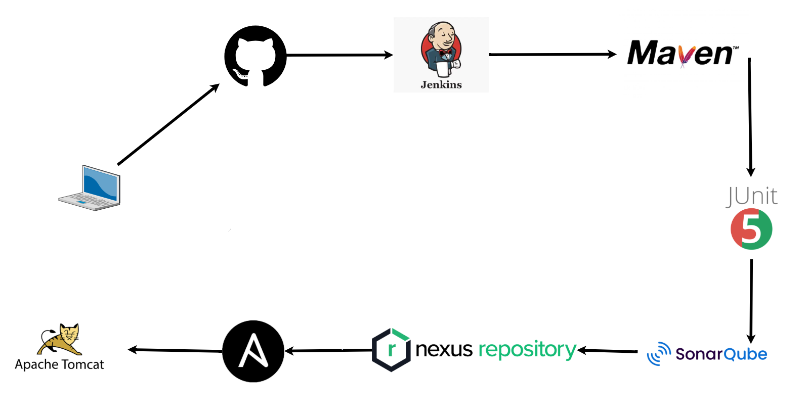
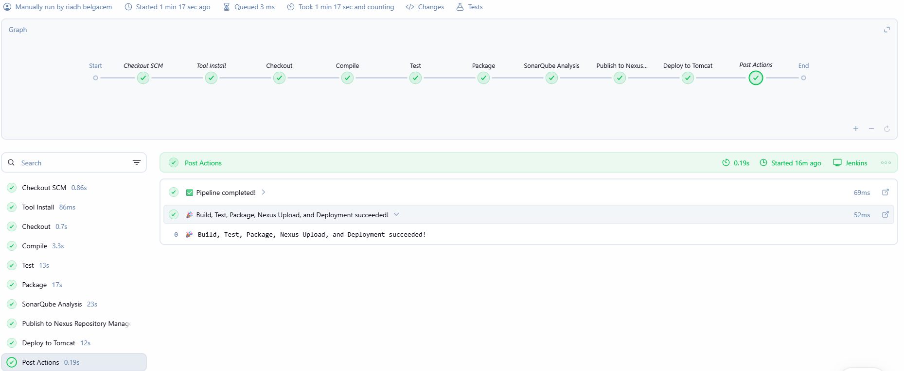

# Country Service - CI/CD Pipeline with Jenkins

[]()
[]()
[]()
[]()

---

## Project Overview

**Country Service** is a RESTful web service built with Spring Boot that provides CRUD operations for managing country data. The project demonstrates a complete CI/CD pipeline implementation using Jenkins, including automated testing, code quality analysis, artifact management, and automated deployment.

---

## Technologies Used

**Backend:** Java 21, Spring Boot 3.5.6, Spring Data JPA, Spring Data REST, H2/MySQL, Lombok  
**Testing:** JUnit 5, Mockito, Spring Boot Test, MockMvc  
**CI/CD:** Jenkins, Maven, SonarQube, Nexus, Ansible, Docker, Tomcat, ngrok

---

## Architecture



---

## Prerequisites

- Ubuntu/Debian-based Linux (WSL2 for Windows)
- Java 21, Maven 3.9+, Docker, Git

---

## Installation & Setup

### 1. Jenkins Installation

#### Step 1.1: Install Java 21

```bash
# Update system packages
sudo apt update && sudo apt upgrade -y

# Install Java 21
sudo apt install -y openjdk-21-jdk
```

#### Step 1.2: Set JAVA_HOME

```bash
# Set JAVA_HOME environment variable
export JAVA_HOME="/usr/lib/jvm/java-21-openjdk-amd64/"
export PATH="$JAVA_HOME/bin:$PATH"

# Make it permanent (add to ~/.bashrc or ~/.profile)
echo 'export JAVA_HOME="/usr/lib/jvm/java-21-openjdk-amd64/"' >> ~/.bashrc
echo 'export PATH="$JAVA_HOME/bin:$PATH"' >> ~/.bashrc
source ~/.bashrc
```

#### Step 1.3: Install Maven

```bash
# Install Maven
sudo apt install -y maven

# Set M2_HOME
export M2_HOME="/usr/share/maven"
export PATH="$M2_HOME/bin:$PATH"

# Make it permanent
echo 'export M2_HOME="/usr/share/maven"' >> ~/.bashrc
echo 'export PATH="$M2_HOME/bin:$PATH"' >> ~/.bashrc
source ~/.bashrc
```

#### Step 1.4: Install Jenkins

```bash
# Add Jenkins repository key
sudo wget -O /usr/share/keyrings/jenkins-keyring.asc \
  https://pkg.jenkins.io/debian-stable/jenkins.io-2023.key

# Add Jenkins repository
echo "deb [signed-by=/usr/share/keyrings/jenkins-keyring.asc]" \
  https://pkg.jenkins.io/debian-stable binary/ | sudo tee \
  /etc/apt/sources.list.d/jenkins.list > /dev/null

# Update package list
sudo apt update

# Install Jenkins
sudo apt install -y jenkins

# Start Jenkins service
sudo systemctl enable jenkins
sudo systemctl start jenkins
```

Access Jenkins at: `http://localhost:8080` (Get initial password: `sudo cat /var/lib/jenkins/secrets/initialAdminPassword`)

---

### 2. Docker Setup

#### Step 2.1: Install Docker

```bash
# Install Docker
sudo apt update
sudo apt install -y docker.io

# Start Docker service
sudo systemctl enable docker
sudo systemctl start docker

# Add current user to docker group
sudo usermod -aG docker $USER
sudo usermod -aG docker jenkins

# Reload group membership (or logout/login)
newgrp docker
```

---

### 3. SonarQube Configuration

#### Step 3.1: Install PostgreSQL (Optional - SonarQube can use embedded DB)

```bash
# Install PostgreSQL
sudo apt update
sudo apt install -y postgresql postgresql-contrib

# Start PostgreSQL
sudo systemctl enable postgresql
sudo systemctl start postgresql
```

#### Step 3.2: Run SonarQube with Docker

```bash
# Pull and run SonarQube container
docker run -d \
  --name sonarqube \
  -p 9000:9000 \
  -e SONAR_ES_BOOTSTRAP_CHECKS_DISABLE=true \
  sonarqube:latest
```

#### Step 3.3: Access SonarQube

- URL: `http://localhost:9000`
- Default credentials:
  - **Username**: `admin`
  - **Password**: `admin` (you'll be prompted to change it)

#### Step 3.4: Generate SonarQube Token

1. Login to SonarQube
2. Go to: **My Account → Security → Generate Tokens**
3. Name: `jenkins-token`
4. Click **Generate**
5. **Copy and save the token** (you'll need it for Jenkins)

---

### 4. Nexus Repository Setup

#### Step 4.1: Run Nexus with Docker

```bash
# Create volume for Nexus data persistence
docker volume create --name nexus-data

# Run Nexus container
docker run -d \
  --name nexus \
  -p 8081:8081 \
  -v nexus-data:/nexus-data \
  sonatype/nexus3:latest
```

Access Nexus at: `http://localhost:8081` (Get initial password: `docker exec nexus cat /nexus-data/admin.password`)

#### Step 4.2: Access Nexus

- URL: `http://localhost:8081`
- Username: `admin`
- Password: Use the password from the command above
- Follow the setup wizard and create a new password

#### Step 4.3: Create Maven Hosted Repository

1. Login to Nexus
2. Go to: **Settings (⚙️) → Repositories → Create repository**
3. Select: **maven2 (hosted)**
4. Name: `maven-1`
5. Version policy: `Mixed`
6. Deployment policy: `Allow redeploy`
7. Click **Create repository**

#### Step 4.4: Create Nexus Credentials

1. Go to: **Settings → Security → Users → Create local user**
2. Username: `jenkins`
3. Password: `jenkins123` (or your choice)
4. Roles: `nx-admin`
5. Save

---

### 5. Ansible Configuration

#### Step 5.1: Install Ansible

```bash
# Install Ansible
sudo apt update
sudo apt install -y ansible
```

#### Step 5.2: Setup SSH for Ansible

```bash
# Generate SSH key for Ansible/Jenkins
ssh-keygen -t rsa -b 4096 -C "jenkins-ansible" -f ~/.ssh/ansible_id_rsa -N ""

# Copy public key to authorized_keys (for local deployment)
cat ~/.ssh/ansible_id_rsa.pub >> ~/.ssh/authorized_keys
chmod 600 ~/.ssh/authorized_keys
```

#### Step 5.3: Install and Start SSH Server (if not installed)

```bash
# Install OpenSSH server
sudo apt update
sudo apt install -y openssh-server

# Enable and start SSH service
sudo systemctl enable ssh
sudo systemctl start ssh
```

#### Step 5.4: Create Ansible Playbook

Create a deployment playbook at `deploy/deploy-tomcat.yml` that finds the WAR file in the target directory, copies it to the Tomcat container, and restarts the container.

---

### 6. Jenkins Configuration

#### Step 6.1: Install Required Jenkins Plugins

1. Go to: **Manage Jenkins → Plugins → Available plugins**
2. Install the following plugins:
   - **SonarQube Scanner**
   - **Nexus Artifact Uploader**
   - **Pipeline**
   - **Git**
   - **Maven Integration**
   - **Ansible**
   - **JUnit**
   - **Docker Pipeline** (optional)

#### Step 6.2: Configure Global Tools

Go to: **Manage Jenkins → Tools**

##### Configure JDK:
- Name: `JDK21`
- JAVA_HOME: `/usr/lib/jvm/java-21-openjdk-amd64/`

##### Configure Maven:
- Name: `M2_HOME`
- MAVEN_HOME: `/usr/share/maven`

##### Configure SonarQube Scanner:
- Name: `SonarQubeScanner`
- Install automatically (latest version)

##### Configure Ansible:
- Name: `Ansible`
- Path: `/usr/bin/ansible-playbook`

#### Step 6.3: Configure SonarQube Server

1. Go to: **Manage Jenkins → System**
2. Find: **SonarQube servers**
3. Click **Add SonarQube**
4. Configuration:
   - Name: `MySonarQubeServer`
   - Server URL: `http://localhost:9000`
   - Server authentication token: Click **Add** → **Jenkins**
     - Kind: **Secret text**
     - Secret: (paste your SonarQube token)
     - ID: `sonarqube-token`
     - Description: `SonarQube Token`
5. Save

#### Step 6.4: Add Nexus Credentials

1. Go to: **Manage Jenkins → Credentials → System → Global credentials**
2. Click **Add Credentials**
3. Configuration:
   - Kind: **Username with password**
   - Username: `jenkins`
   - Password: `jenkins123` (or your Nexus password)
   - ID: `NEXUS_CRED`
   - Description: `Nexus Repository Credentials`
4. Save

#### Step 6.5: Add Ansible SSH Credentials

1. Go to: **Manage Jenkins → Credentials → System → Global credentials**
2. Click **Add Credentials**
3. Configuration:
   - Kind: **SSH Username with private key**
   - ID: `ansible-ssh-key`
   - Description: `Ansible SSH Private Key`
   - Username: `jenkins`
   - Private Key: Click **Enter directly**
     ```bash
     # Copy your private key
     cat ~/.ssh/ansible_id_rsa
     ```
   - Paste the entire private key content
4. Save

#### Step 6.6: Run Tomcat Container

```bash
# Run Tomcat container for deployment
docker run -d \
  --name tomcat \
  -p 8082:8080 \
  tomcat:10.1-jdk21
```

---

### 7. GitHub Webhook Setup

#### Step 7.1: Install ngrok

```bash
# Download ngrok
wget https://bin.equinox.io/c/bNyj1mQVY4c/ngrok-v3-stable-linux-amd64.tgz

# Extract
tar xvzf ngrok-v3-stable-linux-amd64.tgz

# Move to PATH
sudo mv ngrok /usr/local/bin/
```

#### Step 7.2: Setup ngrok Account

1. Go to: https://dashboard.ngrok.com/signup
2. Sign up for a free account
3. Get your authtoken from: https://dashboard.ngrok.com/get-started/your-authtoken
4. Configure ngrok:
   ```bash
   ngrok config add-authtoken YOUR_AUTHTOKEN_HERE
   ```

#### Step 7.3: Start ngrok Tunnel

```bash
# Start ngrok tunnel to Jenkins (port 8080)
ngrok http 8080
```

**Copy the Forwarding URL** (e.g., `https://abc123.ngrok.io`)

#### Step 7.4: Configure GitHub Webhook

1. Go to your GitHub repository: `https://github.com/riadhbelgacem/TP-CI-CD`
2. Go to: **Settings → Webhooks → Add webhook**
3. Configuration:
   - **Payload URL**: `https://abc123.ngrok.io/github-webhook/`
   - **Content type**: `application/json`
   - **Which events**: Select **Just the push event**
   - **Active**: ✅ Checked
4. Click **Add webhook**

---

### 8. Create Jenkins Pipeline

#### Step 8.1: Create New Pipeline Job

1. Go to Jenkins Dashboard
2. Click **New Item**
3. Name: `Country-Service-CI-CD`
4. Type: **Pipeline**
5. Click **OK**

#### Step 8.2: Configure Pipeline

1. **General Section**:
   - ✅ Check **GitHub project**
   - Project url: `https://github.com/riadhbelgacem/TP-CI-CD`

2. **Build Triggers**:
   - ✅ Check **GitHub hook trigger for GITScm polling**

3. **Pipeline Section**:
   - Definition: **Pipeline script from SCM**
   - SCM: **Git**
   - Repository URL: `https://github.com/riadhbelgacem/TP-CI-CD.git`
   - Branch: `*/main`
   - Script Path: `Jenkinsfile`

4. Click **Save**

#### Step 8.3: Create Jenkinsfile

Create a `Jenkinsfile` in your project root with stages for Checkout, Compile, Test, Package, SonarQube Analysis, Nexus Upload, and Deployment to Tomcat.

---

## Running the Application

### Local Development

```bash
# Clone the repository
git clone https://github.com/riadhbelgacem/TP-CI-CD.git
cd TP-CI-CD

# Build the project
mvn clean install

# Run the application
mvn spring-boot:run
```

Access the application at: `http://localhost:8082`

---

## CI/CD Pipeline

### Pipeline Stages



1. **Checkout** - Pull latest code from GitHub
2. **Compile** - Compile Java source code
3. **Test** - Run unit and integration tests
4. **Package** - Build JAR/WAR artifact
5. **SonarQube Analysis** - Analyze code quality
6. **Nexus Upload** - Publish artifact to Nexus
7. **Deploy to Tomcat** - Deploy using Ansible

### Trigger Pipeline

The pipeline is automatically triggered when you push to the `main` branch:

```bash
git add .
git commit -m "Your commit message"
git push origin main
```

---

## API Endpoints

### Base URL
```
http://localhost:8082
```

### Endpoints

| Method | Endpoint | Description |
|--------|----------|-------------|
| GET | `/getcountries` | Get all countries |
| GET | `/getcountries/{id}` | Get country by ID |
| GET | `/getcountries/countryname?name={name}` | Get country by name |
| POST | `/addcountry` | Add new country |
| PUT | `/updatecountry/{id}` | Update country |
| DELETE | `/deletecountry/{id}` | Delete country |

### Example Requests

#### Get All Countries
```bash
curl -X GET http://localhost:8082/getcountries
```

#### Add New Country
```bash
curl -X POST http://localhost:8082/addcountry \
  -H "Content-Type: application/json" \
  -d '{
    "idCountry": 1,
    "name": "France",
    "capital": "Paris"
  }'
```

#### Update Country
```bash
curl -X PUT http://localhost:8082/updatecountry/1 \
  -H "Content-Type: application/json" \
  -d '{
    "name": "France",
    "capital": "Paris"
  }'
```

#### Delete Country
```bash
curl -X DELETE http://localhost:8082/deletecountry/1
```

---

## Testing

```bash
mvn test
```

### Test Coverage

- **Unit Tests**: Testing individual components
- **Integration Tests**: Testing API endpoints
- **Repository Tests**: Testing data access layer
- **Controller Tests**: Testing with Mockito and MockMvc

### Test Results

Test results are generated in:
- `target/surefire-reports/` - JUnit XML reports
- Available in Jenkins after each build

---

## Monitoring & Quality

- **SonarQube**: `http://localhost:9000` - Code coverage, bugs, vulnerabilities
- **Nexus**: `http://localhost:8081` - Artifact management
- **Jenkins**: `http://localhost:8080` - Build history, test results


---